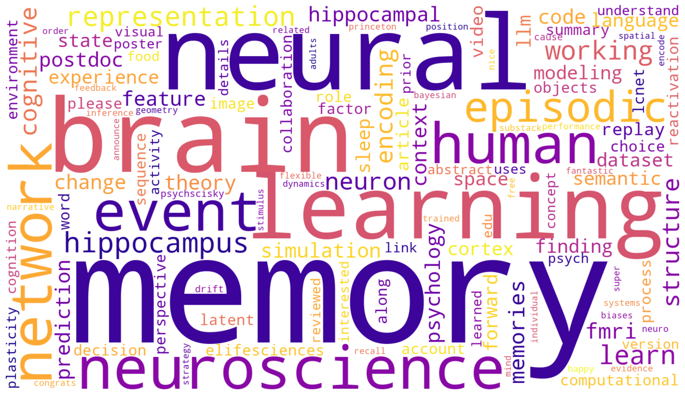

# Daily Paper Tracker

An AI agent that keeps me on top of new papers in computational cognitive neuroscience. Every morning it searches across a broad range of sources — arxiv, bioRxiv, PubMed, 20+ journals, and major ML conferences — filters out the noise, and puts together a clean HTML report grouped by research topic. 

<p align="center">
  
</p>

The keywords it searches for are loosely based on what I actually share on Bluesky ([@qlu.bsky.social](https://bsky.app/profile/qlu.bsky.social)). The word cloud above — made from 212 paper-related posts — gives a pretty honest picture: **memory**, **neural** mechanisms, **learning**, the **hippocampus**, **episodic** encoding, **cognitive** models, **working memory**. That's what the tracker looks for.

## Sources

- **arxiv:** cs.CL, cs.AI, cs.LG, q-bio.NC, stat.ML
- **bioRxiv:** neuroscience section
- **PubMed / MEDLINE**
- **Journals:** Nature, Nature Neuroscience, Nature Machine Intelligence, Nature Human Behaviour, Science, Neuron, eLife, Current Biology, Journal of Neuroscience, Cognition, PNAS, Psychological Review, Cognitive Psychology, Journal of Experimental Psychology: General, Memory & Cognition, Hippocampus, NeuroImage, PLOS Computational Biology, Journal of Cognitive Neuroscience, Cerebral Cortex, eNeuro, Network Neuroscience
- **ML conferences:** NeurIPS, ICLR, ICML, COSYNE
- **Naturalistic neuroimaging datasets:** OpenNeuro, PIEMAN, Sherlock, Tunnel (monitored for new publications)

## How It Works

An AI agent reads `prompts/daily-paper-tracker.md` and runs it daily. The agent:

1. **Searches** all sources listed above using a six-section keyword matrix.
2. **Deduplicates** against `data/seen_papers.json` — matched by DOI, arxiv ID, or title slug, never reported twice.
3. **Filters** for mechanistic relevance, not just keyword hits. Skips pure engineering, narrow clinical studies, and opinion pieces without new data.
4. **Writes** a self-contained HTML report at `outputs/YYYY-MM-DD-paper-tracker.html`, with papers grouped by relevance category.
5. **Pushes** the report to this repo, making it viewable online.

## Keyword Matrix (219 keywords, 6 sections)

| Section | Focus | Example keywords |
|---|---|---|
| A — Episodic Memory | Hippocampus, replay, place/time/grid cells, consolidation, pattern separation, polysemanticity, mixed selectivity | 54 |
| B — Computational Models | TCM, CLS, successor representation, Bayesian efficient coding, planning as inference, simulated experience | 33 |
| C — LLMs & Machine Memory | In-context learning, KV cache, transformer memory, neural modularity, neural geometry, neuroAI alignment | 34 |
| D — Encoding & Retrieval | Reinstatement, oscillations, WM/LTM dissociation, iEEG, schema filling, prior knowledge, individual differences | 33 |
| E — Naturalistic Paradigms | Movie viewing, audiobook listening, conversation, ISC, event segmentation, naturalistic timescales, Sherlock/PIEMAN/Tunnel datasets | 48 |
| F — Methods & Meta-Science | Benchmarks, model validation, reproducibility, neuroAI toolkits, representational geometry, ground truth | 17 |

## Relevance Categories

| Tag | Research Pillar |
|---|---|
| `LLM-Memory` | LLM lingering memory, attention-based episodic memory in transformers |
| `Schema-Episodic` | Schema-guided episodic memory, hippocampal mechanisms |
| `KV-Networks` | Key-value memory networks, serial position effects, temporal context |
| `Encoding-Retrieval` | Encoding/retrieval mechanisms, reinstatement, context effects |
| `Cross-cutting` | Spans multiple pillars or provides theoretical scaffolding |
| `Peripheral` | Adjacent but interesting |

## Bluesky Topic Analysis

I occasionally update the keyword matrix based on what I've been posting about on Bluesky. The word cloud and bar chart in `outputs/` are built from 212 paper-related posts over about 2.5 years. See `outputs/bsky-paper-posts.html` for the full archive.

## Project Structure

```
paper-tracking/
├── prompts/
│   └── daily-paper-tracker.md       # The prompt that drives the agent
├── data/
│   └── seen_papers.json             # Deduplication store (DOI → date first seen)
├── outputs/
│   ├── YYYY-MM-DD-paper-tracker.html # Daily reports
│   └── bsky-paper-posts.html         # Bluesky paper post archive
```

## Modifying

Edit `prompts/daily-paper-tracker.md` to change keywords, sources, or output format. The agent picks it up on the next run — no need to touch anything else.

To reset the deduplication store (say, after a bad run), delete `data/seen_papers.json`. A fresh one gets created on the next run.

## Dependencies

Any AI agent with web search and code execution can run this prompt. The auto-push to GitHub uses the `gh` CLI, so make sure it's authenticated. Optionally, academic search APIs (PubMed, Semantic Scholar) improve coverage.
