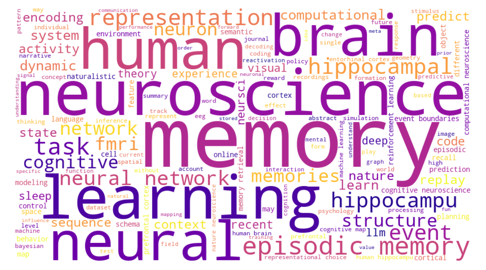

# Daily Paper Tracker

[https://qihongl.github.io/paper-tracking/](https://qihongl.github.io/paper-tracking/)

This is an agent skill to keep me on top of new papers in computational cognitive neuroscience of learning and memory. I'm experimenting with it to see if it can provide a better coverage than Bluesky/X.

Every morning an AI agent searches across a broad range of sources — arxiv, bioRxiv, PubMed, 66 journals, and major ML conferences — filters out the noise, and puts together a clean HTML report grouped by research topic. 

<p align="center">
  
</p>

## How It Works

An AI agent reads `prompts/daily-paper-tracker.md` and runs it daily. The agent:

1. **Searches** all sources listed above using a seven-section keyword matrix.
2. **Deduplicates** against `data/seen_papers.json` — matched by DOI, arxiv ID, or title slug, never reported twice.
3. **Filters** for mechanistic relevance, not just keyword hits. Skips pure engineering, narrow clinical studies, and opinion pieces without new data.
4. **Writes** a self-contained HTML report at `outputs/YYYY-MM-DD-paper-tracker.html`, with papers grouped by relevance category.
5. **Pushes** the report to this repo, making it viewable online.

## Sources

- **arxiv:** cs.CL, cs.AI, cs.LG, q-bio.NC, stat.ML
- **bioRxiv:** neuroscience section
- **PsyArXiv:** psychology, cognitive science, neuroscience preprints
- **PubMed / MEDLINE**
- **Journals (66):** Nature, Nature Neuroscience, Nature Machine Intelligence, Nature Human Behaviour, Nature Communications, Science, Neuron, eLife, Current Biology, Journal of Neuroscience, Cognition, PNAS, Psychological Review, Psychological Science, Cognitive Psychology, Cognitive Science, JEP: General, JEP: Learning Memory & Cognition, Memory, Memory & Cognition, Hippocampus, NeuroImage, PLOS Computational Biology, PLOS Biology, Journal of Cognitive Neuroscience, Cerebral Cortex, eNeuro, Network Neuroscience, Trends in Cognitive Sciences, Communications Psychology, Communications Biology, Learning & Memory, Neurobiology of Learning and Memory, Psychonomic Bulletin & Review, Neural Computation, Current Opinion in Neurobiology, Current Opinion in Behavioral Sciences, Neuroscience & Biobehavioral Reviews, Journal of Memory and Language, Annual Review of Neuroscience, Annual Review of Psychology, Behavioral and Brain Sciences, Cell, Cell Reports, Cortex, Cognitive Neuroscience, Trends in Neurosciences, Nature Reviews Neuroscience, Nature Reviews Psychology, Nature Medicine, Nature Methods, Nature Protocols, Nature Computational Science, Scientific Data, Scientific Reports, Science Advances, iScience, Imaging Neuroscience, Human Brain Mapping, Neuropsychologia, Behavior Research Methods, Psychophysiology, The Neuroscientist, Perspectives on Psychological Science, Neurobiology of Aging, npj Science of Learning
- **ML conferences:** NeurIPS, ICLR, ICML, COSYNE, ACL, EMNLP, NAACL, CVPR, ICCV (memory-adjacent)
- **Naturalistic neuroimaging datasets:** OpenNeuro, PIEMAN, Sherlock, Tunnel (monitored for new publications)

## Keyword Matrix (390 keywords, 7 sections)

| Section | Focus | Example keywords |
|---|---|---|
| A — Human/Animal Systems & Cognitive Neuroscience | Hippocampus, replay (forward/reverse/sleep/awake), place/time/grid cells, consolidation, pattern separation, polysemanticity, mixed selectivity, schema binding, neural activity, neurons, cognitive map | 134 |
| B — Computational Models of Memory | TCM, CLS, successor representation, predictive processing, Bayesian efficient coding, planning as inference, neural manifold, population coding, deep learning, simulations, generalization | 58 |
| C — LLMs & Machine Memory | In-context learning, KV cache, transformer memory, semantic memory in LLMs, narrative understanding, neural modularity, neural geometry, mechanistic interpretability, neuroAI alignment | 47 |
| D — Encoding, WM & Retrieval | Reinstatement, oscillations, working memory (capacity/gating/binding), visual/object/scene memory, WM/LTM dissociation, iEEG, schema filling, prior knowledge, individual differences | 63 |
| E — Naturalistic Paradigms | Movie viewing, audiobook listening, conversation, ISC, event segmentation, naturalistic timescales, Sherlock/PIEMAN/Tunnel datasets | 43 |
| F — Methods & Meta-Science | Benchmarks, model validation, reproducibility, neuroAI toolkits, representational geometry, ground truth | 17 |
| G — RL, Decision-Making & Learning/Generalization | Reinforcement learning, reward, decision-making, choice, optimal control, cognitive biases, effort, prediction error, feedback, hierarchical memory, generalization, online learning, environment, policy | 28 |

## Relevance Categories

| Tag | Research Pillar |
|---|---|
| `LLM-Memory` | LLM lingering memory, attention-based episodic memory in transformers |
| `Schema-Episodic` | Schema-guided episodic memory, hippocampal mechanisms |
| `KV-Networks` | Key-value memory networks, serial position effects, temporal context |
| `Encoding-Retrieval` | Encoding/retrieval mechanisms, reinstatement, context effects |
| `Cross-cutting` | Spans multiple pillars or provides theoretical scaffolding |
| `Peripheral` | Adjacent but interesting |

## Topic Analysis

The tracker's keyword matrix and relevance categories are built around what I actually read and share. That interest is drawn from **both Twitter/X** ([@Qihong_Lu](https://x.com/Qihong_Lu)) and **Bluesky** ([@qlu.bsky.social](https://bsky.app/profile/qlu.bsky.social)). The word cloud above summarizes the topics across **1,155 paper-related posts** from those two accounts: **memory**, **events**, **neural** mechanisms, **deep** learning, **prediction**, **theory** and **modeling**, **sequences**, **online** learning, cognitive **maps**, **training**, **psychology**, **recordings**, **reward**, **hierarchical** structure, and **generalization**. The full archive is in `outputs/paper-posts-unified.html`.

## Project Structure

```
paper-tracking/
├── prompts/
│   └── daily-paper-tracker.md       # The prompt that drives the agent
├── data/
│   └── seen_papers.json             # Deduplication store (DOI → date first seen)
├── outputs/
│   ├── YYYY-MM-DD-paper-tracker.html # Daily reports
│   ├── paper-posts-unified.html       # Unified X + Bluesky paper post archive
│   ├── wordcloud-unified.png          # Word cloud of shared paper topics
│   └── keyword-suggestions.md        # Candidate keywords for matrix updates
```

## Coverage Tooling (local)

The keyword matrix and source list are audited against the researcher's local 4,269-PDF library (semantic index over Paperpile). Scripts in `scripts/`:

- `coverage_audit.py` — two-layer audit (venue gate × keyword gate) of the library's recent papers; miss mining; venue calibration; section analysis; precision sampling. Full run: `env -u PYTHONPATH /Users/qlu/miniforge3/bin/python3 scripts/coverage_audit.py all`
- `coverage_check.py` — **required before any matrix/source edit**: verifies no regression vs. the pinned baseline and the reported-papers golden set. Exit 0 = safe to commit.
- `run_health.py` — cadence/dedup reliability report (`outputs/run-health.md`).

See `outputs/coverage-audit.md` for the latest audit. The 2026-08-01 audit expanded journals 47→66, direct-scan 10→16, added ACL/CVPR proceedings, and added a library cross-check step to the daily prompt.

## Modifying

Edit `prompts/daily-paper-tracker.md` to change keywords, sources, or output format. The agent picks it up on the next run — no need to touch anything else.

To reset the deduplication store (say, after a bad run), delete `data/seen_papers.json`. A fresh one gets created on the next run.

## Dependencies

Any AI agent with web search and code execution can run this prompt. The auto-push to GitHub uses the `gh` CLI, so make sure it's authenticated. Optionally, academic search APIs (PubMed, Semantic Scholar) improve coverage.
